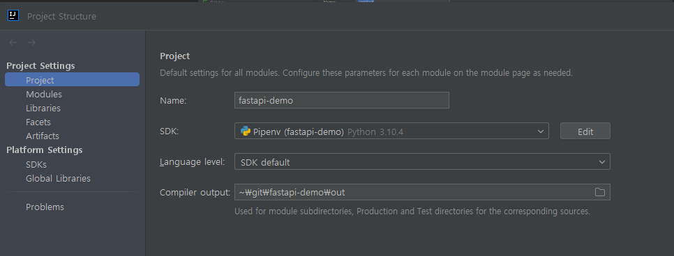
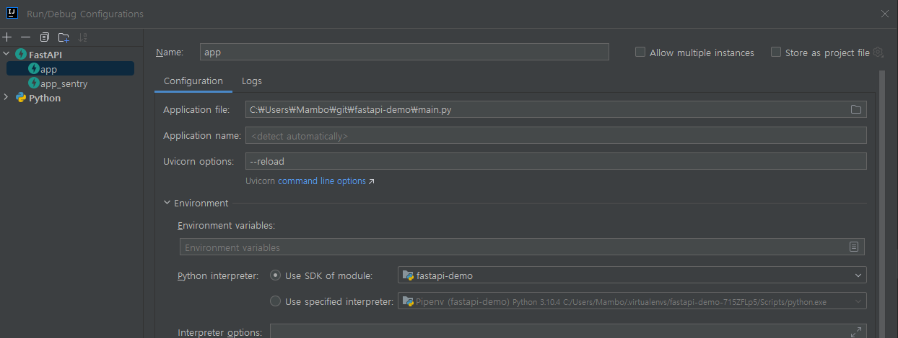

# FastAPI Demo

## How to run using FastAPI
```shell
fastapi dev main.py
```

## How to run with intellij

1. Install python3.9+
2. Add python sdk with pipenv

3. Set up run configuration with FastAPI


